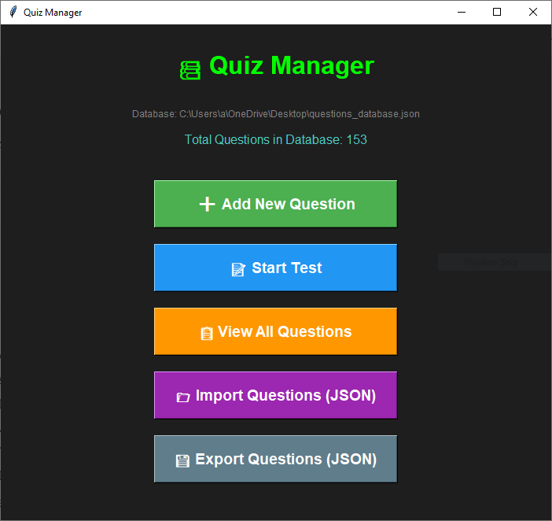

# Quiz Manager 📚

A simple desktop quiz application built with Python and Tkinter. Create, manage, and test yourself with custom quiz questions.

## Features

- ✅ **Create Questions**: Add questions with 4 answer choices (A, B, C, D)
- ✅ **Test Mode**: Take randomized quizzes and get instant feedback
- ✅ **Explanations**: See detailed explanations for correct/incorrect answers
- ✅ **Import/Export**: Share question sets via JSON files
- ✅ **Persistent Storage**: Questions saved automatically in JSON format
- ✅ **Score Tracking**: Get percentage scores and performance grades
- ✅ **No Console Window**: Runs cleanly without black console window

## Screenshots




## Requirements

- Python 3.6 or higher
- tkinter (usually included with Python)
- No additional packages required!

## Installation

### Windows

1. **Install Python**
   - Download from [python.org](https://www.python.org/downloads/)
   - ⚠️ **Important**: Check "Add Python to PATH" during installation
   - ⚠️ **Important**: Keep default options (includes Tkinter)

2. **Download the project**
   
   **Option A: Download ZIP**
   - Click the green "Code" button above
   - Select "Download ZIP"
   - Extract to your desired location
   
   **Option B: Git Clone**
```bash
   git clone https://github.com/YOUR_USERNAME/quiz-manager.git
   cd quiz-manager
```

3. **Run the application**
   
   Simply **double-click** `quiz_app.pyw`
   
   ✅ No console window will appear - just the quiz app!
   
   **Alternative methods:**
```bash
   # From command line (if you want to see error messages)
   python quiz_app.pyw
   
   # Or explicitly use pythonw
   pythonw quiz_app.pyw
```

### macOS

1. **Install Python** (if not already installed)
```bash
   brew install python3
```

2. **Download the project**
```bash
   git clone https://github.com/YOUR_USERNAME/quiz-manager.git
   cd quiz-manager
```

3. **Run the application**
```bash
   # Double-click quiz_app.pyw in Finder
   # Or from terminal:
   python3 quiz_app.pyw
```

### Linux

1. **Install Python and Tkinter**
```bash
   # Ubuntu/Debian
   sudo apt-get update
   sudo apt-get install python3 python3-tk

   # Fedora
   sudo dnf install python3 python3-tkinter
```

2. **Download the project**
```bash
   git clone https://github.com/YOUR_USERNAME/quiz-manager.git
   cd quiz-manager
```

3. **Run the application**
```bash
   python3 quiz_app.pyw
```

## What is .pyw?

The `.pyw` extension is used for Python GUI applications on Windows:
- ✅ Runs without showing a console/terminal window
- ✅ Cleaner user experience
- ✅ Same as `.py` but launches with `pythonw.exe` instead of `python.exe`

**Note**: On macOS and Linux, `.pyw` files work the same as `.py` files.

## Usage

### Adding Questions

1. Click **"Add New Question"**
2. Enter your question text
3. Fill in 4 answer choices (A, B, C, D)
4. Select the correct answer
5. Provide an explanation
6. Click **"Save Question"**

### Taking a Test

1. Click **"Start Test"**
2. Answer each question by selecting A, B, C, or D
3. Click **"Submit Answer"** to see if you're correct
4. Read the explanation
5. Continue to the next question
6. View your final score!

### Importing/Exporting Questions

- **Import**: Click "Import Questions" and select a JSON file
- **Export**: Click "Export Questions" to save your question bank

## Question Format (JSON)

Questions are stored in `questions_database.json`:
```json
[
  {
    "question": "What is the capital of France?",
    "answers": [
      "London",
      "Berlin",
      "Paris",
      "Madrid"
    ],
    "correct": 2,
    "explanation": "Paris is the capital of France. It's located in the north-central part of the country."
  }
]
```

- `correct`: 0 = A, 1 = B, 2 = C, 3 = D

## Sample Questions

A sample question set is included in `sample_questions.json`. Import it to get started!

## Troubleshooting

### "No module named 'tkinter'" error

**Windows/macOS**: Tkinter should be included. Reinstall Python with default options.

**Linux**:
```bash
sudo apt-get install python3-tk
```

### Program doesn't start when double-clicking

**Check Python installation:**
```bash
python --version
```

**Manual run to see errors:**
```bash
# This will show any error messages
python quiz_app.pyw
```

**File association issue (Windows):**
- Right-click `quiz_app.pyw`
- "Open with" → "Choose another app"
- Select Python (or browse to `C:\Python3X\pythonw.exe`)
- Check "Always use this app"

### Console window appears (Windows)

This shouldn't happen with `.pyw`, but if it does:
- Make sure the file extension is `.pyw` not `.py`
- Run with: `pythonw quiz_app.pyw`

### Questions not saving

- Make sure you have write permissions in the folder
- The file `questions_database.json` will be created automatically in the same folder

## Files Created

When you run the app, it creates:
- `questions_database.json` - Your question bank (saved automatically)

This file is in the same folder as `quiz_app.pyw`.

## Creating a Desktop Shortcut (Windows)

1. Right-click on `quiz_app.pyw`
2. Select "Create shortcut"
3. Drag the shortcut to your Desktop
4. (Optional) Right-click shortcut → Properties → Change Icon

## Contributing

Contributions are welcome! Please feel free to submit a Pull Request.

## License

This project is licensed under the MIT License - see the [LICENSE](LICENSE) file for details.

## Author

**Your Name**
- GitHub: [@YOUR_USERNAME](https://github.com/YOUR_USERNAME)

## Acknowledgments

- Built with Python and Tkinter
- Inspired by the need for simple, offline quiz tools
- Uses `.pyw` for cleaner Windows GUI experience
```

### 3️⃣ **LICENSE** (same as before)
```
MIT License

Copyright (c) 2025 Your Name

Permission is hereby granted, free of charge, to any person obtaining a copy
of this software and associated documentation files (the "Software"), to deal
in the Software without restriction, including without limitation the rights
to use, copy, modify, merge, publish, distribute, sublicense, and/or sell
copies of the Software, and to permit persons to whom the Software is
furnished to do so, subject to the following conditions:

The above copyright notice and this permission notice shall be included in all
copies or substantial portions of the Software.

THE SOFTWARE IS PROVIDED "AS IS", WITHOUT WARRANTY OF ANY KIND, EXPRESS OR
IMPLIED, INCLUDING BUT NOT LIMITED TO THE WARRANTIES OF MERCHANTABILITY,
FITNESS FOR A PARTICULAR PURPOSE AND NONINFRINGEMENT. IN NO EVENT SHALL THE
AUTHORS OR COPYRIGHT HOLDERS BE LIABLE FOR ANY CLAIM, DAMAGES OR OTHER
LIABILITY, WHETHER IN AN ACTION OF CONTRACT, TORT OR OTHERWISE, ARISING FROM,
OUT OF OR IN CONNECTION WITH THE SOFTWARE OR THE USE OR OTHER DEALINGS IN THE
SOFTWARE.
```

### 4️⃣ **sample_questions.json** (same as before)

### 5️⃣ **.gitignore** (updated)
```
# Python
__pycache__/
*.py[cod]
*$py.class
*.so
.Python

# Virtual environments
venv/
env/
ENV/

# User data - don't upload personal questions
questions_database.json

# Backup files
*.bak
*~

# IDE
.vscode/
.idea/
*.swp
*.swo

# OS
.DS_Store
Thumbs.db
desktop.ini
```

### 6️⃣ **requirements.txt**
```
# No external dependencies required
# Python 3.6+ with tkinter (included by default)

# Note: This project uses .pyw extension for Windows GUI applications
# .pyw files run without showing a console window on Windows
